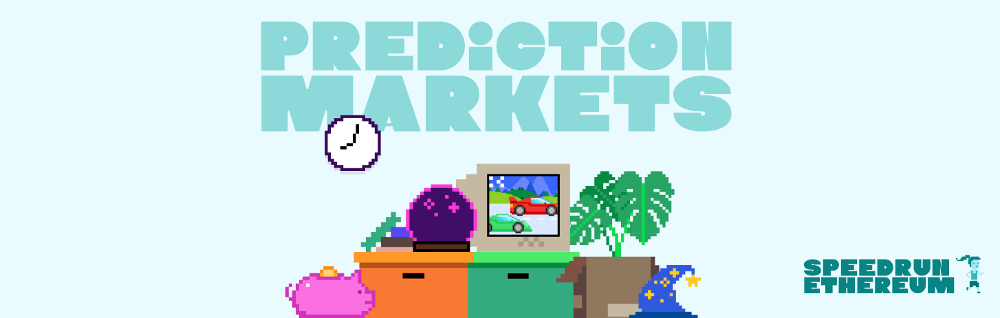
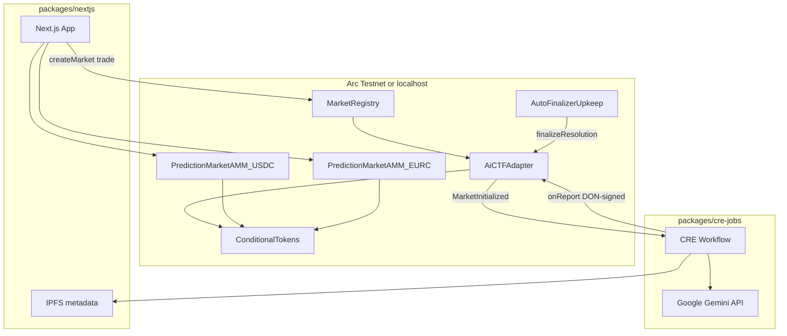
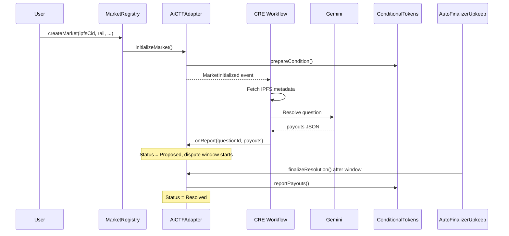

# Prediction Markets — AI-Resolved CTF on Arc



An on-chain prediction market built on **Scaffold-ETH 2**, where users trade **YES/NO outcome shares** backed by **Circle USDC or EURC**, markets are described via **IPFS metadata**, and outcomes are proposed by **Google Gemini** through **Chainlink CRE** (Chainlink Runtime Environment) with a configurable **dispute window** before final settlement on the **Gnosis Conditional Token Framework (CTF)**.

**Primary network:** [Arc Testnet](https://testnet.arc.network/) (chain ID `5042002`) — USDC is the native gas token.

---

## Table of contents

- [What this project does](#what-this-project-does)
- [Architecture](#architecture)
- [Monorepo packages](#monorepo-packages)
- [Smart contracts](#smart-contracts)
- [USDC and EURC collateral rails](#usdc-and-eurc-collateral-rails)
- [Chainlink CRE](#chainlink-cre)
- [Google Gemini](#google-gemini)
- [Frontend](#frontend)
- [End-to-end flows](#end-to-end-flows)
- [IPFS market metadata](#ipfs-market-metadata)
- [Environment variables](#environment-variables)
- [Quick start](#quick-start)
- [Testing and verification](#testing-and-verification)
- [Deployed contracts (Arc Testnet)](#deployed-contracts-arc-testnet)
- [Security and limitations](#security-and-limitations)
- [Original SpeedRunEthereum challenge](#original-speedrunethereum-challenge)
- [Contributing and docs](#contributing-and-docs)

---

## What this project does

This is a **Polymarket-style** prediction market adapted from the [SpeedRunEthereum Prediction Markets challenge](https://speedrunethereum.com/), extended with:

| Capability | Technology |
|------------|------------|
| Outcome tokens | Gnosis **CTF** (ERC-1155 positions) |
| Trading | **AMM** with probability-weighted pricing (from the original challenge) |
| Collateral | **USDC** and **EURC** (6 decimals) — dual settlement rails |
| Market questions | **IPFS** JSON (title, description, outcomes, resolution time) |
| Resolution | **Chainlink CRE** workflow + **Gemini** with Google Search grounding |
| Safety | Dispute window, admin/multisig overrides, optional **Chainlink Automation** finalizer |
| Chain | **Arc Testnet** (Circle L2; USDC for gas and collateral) |

Unlike a traditional sportsbook, users can **buy and sell** outcome shares before resolution. Unlike an order book (e.g. Polymarket’s CLOB), this build uses an **on-chain AMM** for instant, gas-efficient trades.

---

## Architecture



### Resolution sequence



---

## Monorepo packages

Yarn workspaces are defined in [package.json](package.json):

| Package | Path | Role |
|---------|------|------|
| **Hardhat** | [packages/hardhat](packages/hardhat) | Solidity contracts, deploy scripts, tests |
| **Next.js** | [packages/nextjs](packages/nextjs) | Wallet UI, markets, LP, oracle admin, portfolio |
| **CRE job** | [packages/cre-jobs/prediction-market-job](packages/cre-jobs/prediction-market-job) | Chainlink CRE workflow (Gemini + IPFS + on-chain report) |

### Root scripts (common)

| Command | Description |
|---------|-------------|
| `yarn chain` | Start local Hardhat node |
| `yarn deploy` | Deploy all contracts locally |
| `yarn deploy:arcTestnet` | Deploy to Arc Testnet |
| `yarn deploy:arcTestnet:reset` | Force full redeploy on Arc (clears hardhat-deploy cache) |
| `yarn start` | Next.js dev server → http://localhost:3000 |
| `yarn test` | Hardhat tests (`PredictionMarketCTF.ts`) |
| `yarn cre:sync-config` | Sync CRE `config.json` from Hardhat deployments |

---

## Smart contracts

All production contracts live in [packages/hardhat/contracts/](packages/hardhat/contracts/). Deployment order is implemented in [packages/hardhat/deploy/00_deploy_your_contract.ts](packages/hardhat/deploy/00_deploy_your_contract.ts).

### Deployment order

1. **Collateral** — `MockUSDC` + `MockEURC` (localhost) or Circle test tokens (Arc)
2. **ConditionalTokens** — shared Gnosis CTF instance
3. **AiCTFAdapter** — oracle adapter (CRE forwarder + dispute window + optional multisig)
4. **MarketRegistry** — market creation registry
5. **PredictionMarketAMM_USDC** / **PredictionMarketAMM_EURC** — two AMM instances (same bytecode, different collateral)
6. **AutoFinalizerUpkeep** — Chainlink Automation helper
7. **CRE config** — auto-written to `packages/cre-jobs/prediction-market-job/config.json`

---

### ConditionalTokens

**File:** [ConditionalTokens.sol](packages/hardhat/contracts/ConditionalTokens.sol)

A port of the [Gnosis Conditional Token Framework](https://github.com/gnosis/conditional-tokens-contracts) to Solidity `^0.8.0`. Markets are **not** separate deployed contracts; each market is a `conditionId` with ERC-1155 outcome positions.

| Function | Purpose |
|----------|---------|
| `prepareCondition(oracle, questionId, outcomeSlotCount)` | Register a new condition (oracle is always `AiCTFAdapter`) |
| `reportPayouts(questionId, payouts)` | Set winning outcome numerators (called by adapter after finalize) |
| `splitPosition(collateral, parentCollectionId, conditionId, partition, amount)` | Split collateral into outcome tokens |
| `mergePositions(...)` | Merge outcome tokens back into collateral |
| `redeemPositions(...)` | Redeem winning positions after resolution |

**Condition ID:**

```
conditionId = keccak256(abi.encodePacked(oracle, questionId, outcomeSlotCount))
```

For binary markets, `outcomeSlotCount = 2` (YES / NO index sets `1` and `2`).

---

### MarketRegistry

**File:** [MarketRegistry.sol](packages/hardhat/contracts/MarketRegistry.sol)

Lightweight registry: **no new contract deployment per market**. Only primitives are stored on-chain; human-readable text lives on IPFS.

| Item | Detail |
|------|--------|
| `questionId` | `keccak256(abi.encodePacked(ipfsCid))` |
| `createMarket(ipfsCid, outcomeCount, resolutionTime, settlementRail)` | Registers market, calls adapter, emits `MarketCreated` |
| `SettlementRail` | `USDC` (0) or `EURC` (1) — **immutable** after creation |
| `syncStatus(questionId)` | Sync registry status from adapter state |

**Design principle:** The IPFS CID appears **only in events**, not in storage. Indexers and the frontend reconstruct titles from logs + IPFS.

---

### AiCTFAdapter

**File:** [AiCTFAdapter.sol](packages/hardhat/contracts/AiCTFAdapter.sol)  
**Base:** [ReceiverTemplate.sol](packages/hardhat/contracts/ReceiverTemplate.sol) — only the Chainlink CRE **forwarder** may call `onReport`.

#### Market lifecycle

```
Uninitialized → Active → Proposed → Resolved
```

| Step | What happens |
|------|----------------|
| 1 | `initializeMarket(questionId, ipfsCid, outcomeCount, resolutionTime)` — `prepareCondition` on CTF + emit `MarketInitialized` (CRE trigger) |
| 2 | CRE workflow fetches IPFS, queries Gemini, submits `onReport(metadata, report)` with encoded payouts |
| 3 | Adapter enters **Proposed**, starts **dispute window**, emits `ResolutionProposed` |
| 4 | After window: `finalizeResolution(questionId)` → `ctf.reportPayouts()` → **Resolved** |

#### Safety and governance

| Function | Who | Purpose |
|----------|-----|---------|
| `adminOverride(questionId, payouts)` | Owner | Replace proposed payouts during dispute window |
| `multisigOverride(questionId, payouts)` | M-of-N signers | Same, with multisig threshold |
| `adminResolve(questionId, payouts)` | Owner | Immediate resolution (bypass CRE / window) |
| `setDisputeWindow`, `setMultisigSigners` | Owner | Configure parameters |

**Localhost:** dispute window defaults to **60 seconds**. **Arc Testnet:** **2 hours** (configurable at deploy).

---

### PredictionMarketAMM

**File:** [PredictionMarketAMM.sol](packages/hardhat/contracts/PredictionMarketAMM.sol)

Two deployments share the same bytecode:

- `PredictionMarketAMM_USDC` — collateral = USDC
- `PredictionMarketAMM_EURC` — collateral = EURC

Each **pool** is keyed by `conditionId` and holds YES/NO ERC-1155 reserves plus USDC/EURC collateral.

#### Pricing (preserved from SpeedRunEthereum)

Trades use a **probability-weighted** formula (not a constant-product `x·y=k` pool):

```
price = initialTokenValue × avgProbability × amount

avgProbability = (probabilityBefore + probabilityAfter) / 2
probability      = targetOutcomeReserve / totalReserves
```

`PRECISION = 1e6` matches **6-decimal** stablecoins. `initialTokenValue` is set per pool at creation (analogous to the original 0.01 ETH per share).

#### Key functions

| Function | Role |
|----------|------|
| `createPool(conditionId, yesTokenId, noTokenId, usdcAmount, initialYesProbability, percentageToLock)` | LP seeds pool; splits collateral via CTF |
| `addLiquidity` / `removeLiquidity` | LP manages collateral |
| `buyTokens(conditionId, outcome, amount, maxUsdc)` | User buys YES (0) or NO (1) shares |
| `sellTokens(conditionId, outcome, amount, minUsdc)` | User sells shares back to pool |
| Post-resolution | Pool marked `resolved`; LPs and users redeem via CTF |

Trading is disabled after the CTF condition is resolved (`notResolved` modifier).

---

### AutoFinalizerUpkeep

**File:** [AutoFinalizerUpkeep.sol](packages/hardhat/contracts/AutoFinalizerUpkeep.sol)

[Chainlink Automation](https://docs.chain.link/chainlink-automation) upkeep that:

1. `checkUpkeep` — scans `MarketRegistry.getAllMarkets()`, finds **Proposed** markets past `proposedAt + disputeWindow`
2. `performUpkeep` — calls `AiCTFAdapter.finalizeResolution(questionId)`

Registered on the adapter via `setUpkeepFinalizer` at deploy time.

---

### Legacy contracts (challenge only)

These are **not** used by the production frontend:

| Contract | Path | Notes |
|----------|------|-------|
| `PredictionMarket` | [PredictionMarket.sol](packages/hardhat/contracts/PredictionMarket.sol) | Original ETH-collateral AMM, one contract per market |
| `PredictionMarketToken` | [PredictionMarketToken.sol](packages/hardhat/contracts/PredictionMarketToken.sol) | ERC-20 YES/NO tokens for the challenge |

Active tests: [packages/hardhat/test/PredictionMarketCTF.ts](packages/hardhat/test/PredictionMarketCTF.ts).

---

## USDC and EURC collateral rails

### Why two rails?

The **CTF** and **MarketRegistry** are shared. Each market picks a **settlement rail** at creation (`USDC` or `EURC`). Trading and liquidity use the matching **AMM instance** and **collateral token**:

```text
Market (EURC rail) → PredictionMarketAMM_EURC + Circle EURC
Market (USDC rail) → PredictionMarketAMM_USDC + Circle USDC
```

Frontend routing: [packages/nextjs/lib/marketRails.ts](packages/nextjs/lib/marketRails.ts) — `ammContractName()`, `collateralContractName()`, feed filters.

### Token addresses

| Environment | USDC | EURC |
|-------------|------|------|
| **Arc Testnet** (Circle official) | `0x3600000000000000000000000000000000000000` | `0x89B50855Aa3bE2F677cD6303Cec089B5F319D72a` |
| **Localhost** | `MockUSDC` (mintable, 100k to deployer) | `MockEURC` (mintable) |

On Arc, **USDC is the native gas token** — fund your deployer and users with test USDC from the [Circle faucet](https://faucet.circle.com/).

Override addresses via env: `ARC_USDC_ADDRESS`, `ARC_EURC_ADDRESS` (see [deploy script](packages/hardhat/deploy/00_deploy_your_contract.ts)).

### Arc Testnet

- Chain ID: `5042002`
- RPC: `https://rpc.testnet.arc.network`
- Explorer: https://testnet.arcscan.app/
- Deploy: `yarn deploy:arcTestnet`

---

## Chainlink CRE

**CRE** = [Chainlink Runtime Environment](https://docs.chain.link/cre/) — decentralized workflow execution where a **DON** (Decentralized Oracle Network) reacts to on-chain events, runs allowed off-chain capabilities (HTTP), reaches consensus, and submits **attested reports** on-chain.

### Package layout

| Path | Purpose |
|------|---------|
| [packages/cre-jobs/prediction-market-job/main.ts](packages/cre-jobs/prediction-market-job/main.ts) | Workflow entry (log trigger → IPFS → Gemini → `onReport`) |
| [workflow.yaml](packages/cre-jobs/prediction-market-job/workflow.yaml) | HTTP allowlist, simulation vs staging |
| [config.json](packages/cre-jobs/prediction-market-job/config.json) | Adapter/registry addresses, chain selector, Gemini model |
| [project.yaml](packages/cre-jobs/project.yaml) | CRE project RPC settings |

### Resolution pipeline

1. `MarketRegistry.createMarket` → `AiCTFAdapter.initializeMarket` → **`MarketInitialized`** event
2. CRE **log trigger** decodes `questionId`, `ipfsCid`, `resolutionTime`, `outcomeCount`
3. **`runInNodeMode`** + `consensusIdenticalAggregation`: fetch IPFS JSON from allowed gateways
4. **Gemini** call (see next section) → parse `{ reasoning, payouts }`
5. **`parsePayouts()`** with JSON and NLP fallbacks; inconclusive → all `1`s (split/refund semantics in CTF)
6. DON-signed **`onReport(metadata, abi.encode(questionId, payouts))`** via `report()` + `evmClient.writeReport()`
7. Adapter → **Proposed** + dispute window
8. **`finalizeResolution`** — manual (oracle UI), or **`AutoFinalizerUpkeep`**

### HTTP allowlist

CRE only permits domains declared in `workflow.yaml`:

- `generativelanguage.googleapis.com` (Gemini)
- `dweb.link`, `ipfs.io`, `gateway.pinata.cloud`, `cloudflare-ipfs.com` (IPFS)

### CRE forwarder addresses

| Network | Forwarder |
|---------|-----------|
| Arc Testnet | `0x6E9EE680ef59ef64Aa8C7371279c27E496b5eDc1` |
| Sepolia | `0x15fC6ae953E024d975e77382eEeC56A9101f9F88` |
| Localhost | Deployer address (simulate CRE manually) |

Override: `ARC_CRE_FORWARDER_ADDRESS`, `CRE_FORWARDER_ADDRESS`, `CRE_CHAIN_SELECTOR_NAME` (Arc default: `arc-testnet`).

### Local development commands

From repo root or `packages/cre-jobs/prediction-market-job`:

```sh
# After yarn deploy — syncs adapter/registry into config.json
yarn cre:sync-config

cd packages/cre-jobs/prediction-market-job
npm run simulate          # CRE local simulation
npm run resolve           # Simulate resolution for a market
npm run resolve:broadcast # Same, broadcast onReport tx
npm run deploy            # cre workflow deploy --target staging
```

Requires **`GEMINI_API_KEY`** (see [Environment variables](#environment-variables)).

### WASM constraints

The CRE workflow runs in WASM: **no `async/await`**, synchronous `.result()` chains only, `Buffer` instead of `btoa` for HTTP bodies. See comments at the top of `main.ts`.

---

## Google Gemini

Gemini acts as a **factual resolution assistant** inside the CRE DON — not a trustless oracle on its own. The dispute window and admin/multisig paths exist because AI output can be wrong.

### Configuration

| Setting | Default | Location |
|---------|---------|----------|
| Model | `gemini-2.5-flash` | `config.json` → `geminiModel` |
| Temperature | `0` | Deterministic — all DON nodes must agree |
| Grounding | Google Search (`tools: [{ google_search: {} }]`) | Live facts for sports, elections, etc. |

### Prompt design

- **System prompt** (`buildSystemPrompt`): enforces JSON shape — `reasoning` first, `payouts` last; exact outcome count; winner = `1` / losers = `0`; tie or unknown → all `1`s; treats market text as **untrusted input**
- **User prompt** (`buildUserPrompt`): title, description, outcomes, resolution time (UTC unix), category

### DON consensus

HTTP calls run in `runInNodeMode` with **`consensusIdenticalAggregation`** — every node must return identical metadata and Gemini text before a single report is submitted on-chain.

### Payout parsing

`parsePayouts()` handles:

1. Valid JSON with `payouts` array  
2. Bare JSON array in response text  
3. Outcome index / label NLP fallbacks  
4. YES/NO keyword heuristics for binary markets  

Failure → inconclusive payouts (all `1`s) rather than reverting the workflow.

### API key resolution (simulation)

1. `simulationGeminiApiKey` in `config.sim-run.json` (written by npm scripts)  
2. `GEMINI_API_KEY`, `GOOGLE_API_KEY`, or `GEMINI_KEY` in environment  
3. CRE Vault `getSecret({ id: "GEMINI_API_KEY" })` in production  

---

## Frontend

**Package:** [packages/nextjs](packages/nextjs)  
**Stack:** Next.js 15, RainbowKit, wagmi v2, TanStack Query, Tailwind — [Scaffold-ETH 2](https://scaffoldeth.io).

**Default target network:** Arc Testnet (`scaffold.config.ts`).

### Routes

| Route | Purpose |
|-------|---------|
| `/` | Home / featured markets |
| `/markets` | Market feed (category + USDC/EURC rail filters) |
| `/markets/[questionId]` | Trade, chart, position, resolution status |
| `/liquidity-provider` | Create pools, add/remove liquidity |
| `/oracle` | Proposed markets, finalize, admin tools |
| `/portfolio` | Positions, PnL, trade history |
| `/deposit` | Bridge / fund USDC (Circle Bridge Kit) |
| `/wallets` | Wallet management |
| `/debug` | Scaffold-ETH contract debug UI |
| `/blockexplorer` | Local / testnet explorer |

### Contract ABIs

Auto-generated after deploy: [packages/nextjs/contracts/deployedContracts.ts](packages/nextjs/contracts/deployedContracts.ts). Run `yarn deploy` (or Arc deploy) before `yarn start` so addresses match your network.

### IPFS integration

- **Create market:** [CreateMarketModal.tsx](packages/nextjs/components/markets/CreateMarketModal.tsx) uploads JSON to Pinata, then calls `MarketRegistry.createMarket`
- **Read metadata:** [useMarketMetadata.ts](packages/nextjs/hooks/markets/useMarketMetadata.ts), [market-ipfs.ts](packages/nextjs/lib/market-ipfs.ts) — CID from `MarketCreated` logs + optional `localStorage` cache

---

## End-to-end flows

### 1. Create a market

1. User fills the create-market form (title, description, outcomes, category, **USDC or EURC rail**, resolution datetime).
2. Metadata JSON is pinned to **IPFS** (Pinata from the frontend).
3. `MarketRegistry.createMarket(ipfsCid, outcomeCount, resolutionTime, settlementRail)`:
   - `questionId = keccak256(ipfsCid)`
   - Adapter prepares CTF condition
   - `MarketInitialized` fires → **CRE workflow** will run at resolution time

### 2. Provide liquidity

1. LP selects the correct AMM (`PredictionMarketAMM_USDC` or `_EURC`) matching the market rail.
2. `createPool` with USDC/EURC amount, initial YES probability, and lock percentage.
3. Contract splits collateral via CTF into YES/NO reserves.

### 3. Trade

1. User approves collateral, calls `buyTokens` / `sellTokens` on the rail’s AMM.
2. Prices move with implied probability (more demand → higher price on that side).
3. Trading stops when the pool is marked **resolved** (after CTF payout report).

### 4. Resolve and redeem

1. After `resolutionTime`, CRE + Gemini propose payouts → **Proposed**.
2. Dispute window (overrides possible).
3. `finalizeResolution` → CTF `reportPayouts` → **Resolved**.
4. Users **redeem** winning ERC-1155 positions via CTF; LPs withdraw remaining collateral.

---

## IPFS market metadata

Schema used by the frontend and CRE workflow:

```json
{
  "title": "Will Team A win on May 15, 2026?",
  "description": "Resolves YES if Team A wins the scheduled match. Source: official league results.",
  "outcomes": ["Yes", "No"],
  "resolutionTime": 1740000000,
  "category": "Sports",
  "settlementAsset": "USDC",
  "imageUrl": "https://example.com/image.png"
}
```

| Field | Required | Notes |
|-------|----------|-------|
| `title` | Yes | Shown in feed |
| `description` | Yes | Resolution criteria (untrusted in Gemini prompt) |
| `outcomes` | Yes | Min 2; index `0` = first outcome |
| `resolutionTime` | Yes | Unix seconds (UTC) |
| `category` | Yes | Sports, Crypto, Politics, etc. |
| `settlementAsset` | Optional | `USDC` or `EURC` (informational; on-chain rail is `createMarket` arg) |
| `imageUrl` | Optional | Card artwork |

---

## Environment variables

### `packages/hardhat/.env`

| Variable | Purpose |
|----------|---------|
| `DEPLOYER_PRIVATE_KEY` | Deployer account (or use `yarn generate` mnemonic) |
| `ARC_TESTNET_RPC_URL` | Arc RPC (default: `https://rpc.testnet.arc.network`) |
| `ARC_USDC_ADDRESS` / `ARC_EURC_ADDRESS` | Override Circle collateral |
| `ARC_CRE_FORWARDER_ADDRESS` | CRE forwarder on Arc |
| `CRE_CHAIN_SELECTOR_NAME` | e.g. `arc-testnet` |
| `CRE_FORWARDER_ADDRESS` | Sepolia / other networks |
| `MULTISIG_SIGNERS` | Comma-separated addresses |
| `MULTISIG_THRESHOLD` | M-of-N threshold |
| `USE_REAL_USDC` | Use Circle tokens on non-Arc testnets |
| `SEED_MOCK_MARKETS` | `true` to run demo market seeder after deploy |
| `ALCHEMY_API_KEY` | RPC / verification |
| `ETHERSCAN_API_KEY` | Contract verification |

### `packages/nextjs/.env.local`

| Variable | Purpose |
|----------|---------|
| `NEXT_PUBLIC_ALCHEMY_API_KEY` | Client RPC |
| Pinata / IPFS keys | If required by your upload route |

### CRE / Gemini

| Variable | Purpose |
|----------|---------|
| `GEMINI_API_KEY` | Google AI Studio key for simulation and CRE secrets |
| `PRIVATE_KEY` | Optional — CRE simulation broadcast |

Secrets manifest: `packages/cre-jobs/secrets.yaml` (generated on deploy). Example: [secrets.simulation.example.yaml](packages/cre-jobs/prediction-market-job/secrets.simulation.example.yaml).

---

## Quick start

### Requirements

- [Node.js](https://nodejs.org/) >= v20.18.3  
- [Yarn](https://yarnpkg.com/) v1 or v3+  
- [Git](https://git-scm.com/)

### Local (Hardhat + mocks)

**Terminal 1** — local chain:

```sh
yarn install
yarn chain
```

**Terminal 2** — deploy contracts:

```sh
yarn deploy
```

**Terminal 3** — frontend:

```sh
yarn start
```

Open http://localhost:3000. Use the **Debug Contracts** tab or app pages to interact. Rerun `yarn deploy` after contract changes; use `yarn deploy --reset` for a clean state.

**Local CRE simulation** (optional):

```sh
# Set GEMINI_API_KEY in packages/cre-jobs/prediction-market-job/.env
yarn cre:sync-config
cd packages/cre-jobs/prediction-market-job && npm run simulate
```

### Arc Testnet

```sh
# Configure packages/hardhat/.env with DEPLOYER_PRIVATE_KEY
yarn deploy:arcTestnet
```

Fund the deployer with **Arc test USDC** (gas + collateral). Point the frontend at Arc (`scaffold.config.ts` already includes `arcTestnet`).

Force redeploy after collateral or config mistakes:

```sh
yarn deploy:arcTestnet:reset
```

### Production frontend

```sh
yarn vercel        # first deploy
yarn vercel --prod # production URL
```

Use your own Alchemy/Etherscan keys for production (see [Scaffold-ETH env docs](https://docs.scaffoldeth.io)).

---

## Testing and verification

```sh
yarn test
```

Primary suite: [packages/hardhat/test/PredictionMarketCTF.ts](packages/hardhat/test/PredictionMarketCTF.ts) — registry, adapter overrides, AMM pools, resolution paths.

```sh
yarn verify --network arcTestnet
```

Explorer: https://testnet.arcscan.app/

---

## Deployed contracts (Arc Testnet)

Latest recorded deployments under [packages/hardhat/deployments/arcTestnet/](packages/hardhat/deployments/arcTestnet/) (re-run deploy to update):

| Contract | Address |
|----------|---------|
| ConditionalTokens | `0x40503eBe9F1398d631D6d4Bf873dF620055893a5` |
| AiCTFAdapter | `0xC6e6D16BF2EE18137E62AC9c44bCd692448f8354` |
| MarketRegistry | `0x9361Bffb625F9406e30c984410A4e3E422Cf8AcE` |
| PredictionMarketAMM_USDC | `0xB04Fb403928C97a94C7ab7a850c970e67bAF1dcF` |
| PredictionMarketAMM_EURC | `0x1209b8F041294442a6535A719f0Cf3dF9C72C668` |
| AutoFinalizerUpkeep | `0x91a83a9DBfC544d1C956b9C429321d15ab26D57F` |
| Circle USDC | `0x3600000000000000000000000000000000000000` |
| Circle EURC | `0x89B50855Aa3bE2F677cD6303Cec089B5F319D72a` |

---

## Security and limitations

**Not audited for production.** This is a learning and hackathon-grade stack.

| Risk | Mitigation in this build |
|------|---------------------------|
| AI wrong or manipulated | Dispute window; `adminOverride` / `multisigOverride` / `adminResolve` |
| CRE / Gemini downtime | Manual admin resolution; inconclusive payout fallback |
| IPFS unavailability | Multiple gateways in CRE; frontend gateway fallbacks |
| LP loss | AMM inventory risk — skewed flow can lose collateral (see below) |
| Centralized Pinata upload | Anyone can create markets with any CID; resolution is question + time bound |

### LP risk (intuition)

With probability-weighted pricing, a liquidity provider can **lose** if heavy trading concentrates on the winning side. Example (binary market, simplified):

- One user buys a large YES position; YES wins → user profit, LP may net **negative** after paying winners.
- Same trade, NO wins → LP keeps losing-side inventory plus trade fees → **positive** PnL.

Tune `initialYesProbability`, `percentageToLock`, and pool size for your risk tolerance.

### Trust model summary

```text
Trust CRE forwarder + DON  →  onReport authenticity
Trust Gemini + search      →  proposed payouts (disputable)
Trust Circle tokens        →  collateral peg (testnet faucets)
Do not trust market text   →  prompts treat description as untrusted
```

---

## Original SpeedRunEthereum challenge

This repo started as the [Prediction Markets SpeedRunEthereum challenge](https://speedrunethereum.com/) — a step-by-step tutorial building `PredictionMarket.sol` with **ETH** collateral and a manual oracle.

The **production system** documented here replaces that design with:

- Gnosis **CTF** (ERC-1155) instead of per-market ERC-20s  
- **USDC / EURC** instead of ETH  
- **One registry** instead of one contract per market  
- **Chainlink CRE + Gemini** instead of a single `reportOutcome` caller  

The original contracts remain for reference; complete the active learning path via this README and `PredictionMarketCTF.ts`.

Community: [Prediction Markets Challenge Telegram](https://t.me/+NY00cDZ7PdBmNWEy).

---

## Contributing and docs

- Scaffold-ETH 2: https://docs.scaffoldeth.io  
- Website: https://scaffoldeth.io  
- Contributing: [CONTRIBUTING.md](https://github.com/scaffold-eth/scaffold-eth-2/blob/main/CONTRIBUTING.md)  

Built with Next.js, RainbowKit, Hardhat, Wagmi, Viem, TypeScript, Chainlink CRE, and Google Gemini.
